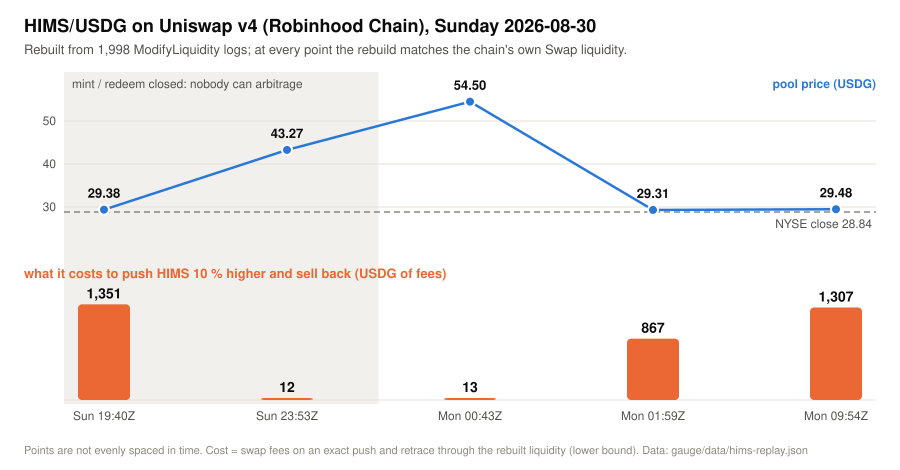
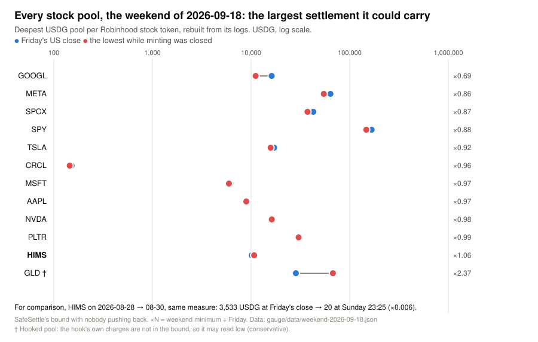
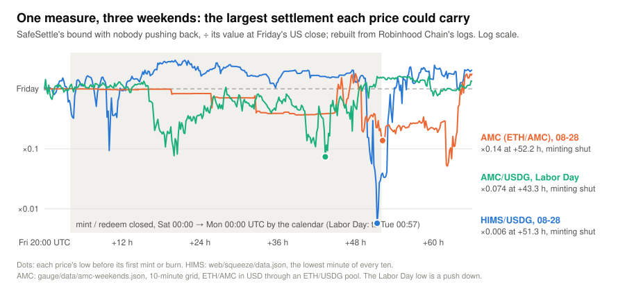

# HAKARI (秤) — what it costs to fake a price

**A Uniswap v4 price is only as trustworthy as it is expensive to fake.** HAKARI is an on-chain, per-pool
bound on what faking a price costs, for any v4 pool, computed at the moment the price is read: `PushCostLens`
prices a push, and `CostModel` turns that cost into the largest exposure the pool can safely carry right now.
`SafeSettle` is a demo user of the bound: it settles on the pool's TWAP only below that line, and refuses above it.

**Try it:** [every stock pool right now vs Friday's close](https://vexi-v1.github.io/vexi-hakari/web/live/) (live, every minute) ·
[measure any pool live](https://vexi-v1.github.io/vexi-hakari/web/) (read-only, nothing deployed) ·
[the HIMS weekend, minute by minute](https://vexi-v1.github.io/vexi-hakari/web/squeeze/) ·
[a live options venue, every fix checked](https://vexi-v1.github.io/vexi-hakari/web/vexi/) (our own, testnet 46630)\
**Verify it:** [the on-chain refusal](https://explorer.testnet.chain.robinhood.com/tx/0xb2ca68bf6b448ffabe9eb8732524f21d6bd463477eb416331249ee591ac0ee88?tab=logs) ·
[verified `SafeSettle`](https://explorer.testnet.chain.robinhood.com/address/0xf360b8ebe3A68e8029308A8CAa76E867B0F02c84?tab=contract) ·
[the Uniswap code, line by line](#where-the-uniswap-integration-is)



Sunday 2026-08-30 was Robinhood Chain's busiest day ever: $270.6M of stock-token volume
([SQD](https://sqd.dev/learn/robinhood-stock-token-volume/)). It was also a day when no stock token can be
minted or redeemed, so nobody could arbitrage. By 23:53 UTC, with minting still closed, pushing the HIMS/USDG
v4 pool 10 % higher cost **12 USDG** in fees (it had cost 1,351 four hours earlier). When minting reopened
the pool stood at **54.50 USDG** (its minute close had peaked at 71.23 at 23:31); the stock had closed Friday at **28.84**. Any lending market, perp or option
settling on that pool would have paid out on a price no arbitrage could correct. HAKARI measures it: the largest
settlement the pool could safely carry fell from **7,259 USDG** at 19:40 to **115 USDG** at 23:53, and `SafeSettle`
would have refused anything above that line. (The real pool has no HAKARI hook and never could: a hook is part of
the `PoolKey`. This is its own swaps replayed through our rules, `npm run hims:hook`.) Our first rule, which chose
between the raw and the truncated TWAP, would have settled on it; an internal review showed why, and the rule
changed ([What the review found](#what-the-review-found-and-what-changed)).

**New to this? The whole story in plain words:** [`web/plain/`](web/plain/) (English, 繁中 with `#zh`), no jargon, every number drawn from the same data.

**See it minute by minute:** [the replay page](https://vexi-v1.github.io/vexi-hakari/web/squeeze/) ([`web/squeeze/`](web/squeeze/)) replays the weekend from Robinhood Chain's own logs —
HIMS, BONER and USDG prices and pool inventories, the float, HAKARI's cost to push, and what X said at the time, in
English and 繁中 (data and checks: [`gauge/src/squeeze/`](gauge/src/squeeze/), `npm run squeeze`).

ETHGlobal Tokyo 2026 · Uniswap Foundation "Best Uniswap Stack Contribution" · MIT ·
[`FEEDBACK.md`](FEEDBACK.md) · spec [`SPEC.md`](SPEC.md) · prompts [`docs/prompts/`](docs/prompts/)

## What it is

| Piece | What it does | Where |
|---|---|---|
| **`PushCostLens`** | What it costs to push any v4 pool to a price and sell straight back. **Exact mode** runs real swaps to a price limit inside `unlock` and reverts with the answer (the V4Quoter pattern, with a price limit V4Quoter lacks). **View mode** walks the tick bitmap through `StateLibrary`, from any starting price, so a contract already inside an unlock can still ask. Needs no deployment: inject its bytecode with an `eth_call` state override. | [`src/PushCostLens.sol`](src/PushCostLens.sol) |
| **`HakariOracleHook`** | OpenZeppelin's truncated oracle hook plus `twaps()`: the raw **and** truncated TWAP in one call. Records before the first swap of each second, so a push undone in the same transaction is never seen. | [`src/HakariOracleHook.sol`](src/HakariOracleHook.sol) |
| **`SafeSettle`** + **`CostModel`** | A demo settlement rule. For moves of 0.5–20 % (plus the gap between the two TWAPs), both ways from the price now, the lens prices holding the move over the window, re-pushing after every pull-back while arbitrage is open. Cost ÷ what the move earns per unit of exposure, minimised, is the **max safe exposure**. The total exposure settling on the price must be below it to settle on the raw TWAP; otherwise it refuses. Emits `Settled(id, raw, trunc, trusted, exposure, maxSafeExposure, bindingTicks, bindingUp)`. | [`src/SafeSettle.sol`](src/SafeSettle.sol), [`src/CostModel.sol`](src/CostModel.sol) |
| **`ExposureGuard`** | A hook-free consumer of the bound: `CostModel` over the deployed lens on any pool key, hook or no hook (`SafeSettle` needs its own hook on the pool). For an ERC-6909 options venue it sums the supply of the series ids it is given, prices the sum at the pool's `slot0`, and emits `Checked(poolId, source, exposure, maxSafeExposure, trusted, bindingTicks, bindingUp, bindingCost, complete)`: `source` 0 is a what-if stated by the caller, 1 a venue read. It verifies the ids it is handed; it cannot enumerate a venue's series, and it cannot gate a fix. | [`src/ExposureGuard.sol`](src/ExposureGuard.sol), [`src/interfaces/IVexi.sol`](src/interfaces/IVexi.sol) |
| **Gauge** (TypeScript) | Live cost ladder, Δ calibration from `Swap` events, any past weekend rebuilt from `ModifyLiquidity` logs, the Robinhood mint-window flag, and the HIMS weekend replayed minute by minute through the hook and `SafeSettle` as if the pool had the hook (it never did; `npm run hims:hook`), each pool's measured reversion time (`npm run reversion`), AMC over two weekends (`npm run amc`), the live board's Friday baseline (`npm run live:baseline`), and every fix our own options venue has made on testnet 46630, replayed against the bound (`npm run vexi`). | [`gauge/`](gauge/), data in [`gauge/data/`](gauge/data/) |
| **Web page** | The live board: every stock pool's max safe exposure now against Friday's close, every minute. Paste any pool → live cost to push it, fenced or not, suggested Δ. HIMS replay, every stock pool over a weekend, AMC, SafeSettle's decisions, and the venue board (`web/vexi/`): six testnet pools' capacity now, every fix with exposure against the bound. | [`web/`](web/), hosted at <https://vexi-v1.github.io/vexi-hakari/web/>; locally `python3 -m http.server 8790 --bind 127.0.0.1` and open `/web/` |

### Why not just truncate the oracle?

Truncation (Panoptic's design: each observation moves at most Δ ticks) slows a sustained push. It does not stop
one: Δ is per *observation*, so a push held with one dust swap a second catches the truncated series up in x/Δ
seconds, and then both TWAPs agree on the fake. And in a genuine crash truncation lags, settling honest holders on
a stale price. So `SafeSettle` does not ask whether the two TWAPs disagree. It asks whether this pool, right now,
is deep enough that faking any relevant move would cost more than it could earn on everything settling on it.

The same real TSLA/USDG liquidity, mirrored segment by segment into a pool with the hook, a 30-minute TWAP
([`test/fork/ShadowPool.fork.t.sol`](test/fork/ShadowPool.fork.t.sol), block 72,481,549):

| | Max safe exposure (v1's ladder, moves to 20 %) | Cheapest fake found | 100,000 USDG | 10,000 USDG |
|---|---|---|---|---|
| Weekend: nobody pushes back | 12,063 USDG | hold +20 % | **refused** | settle on raw |
| Weekday, if arbitrage pulled back every 60 s | 25,269 USDG | push 54,690 ticks, hold 60 s: 2 round trips | **refused** | settle on raw |
| Weekday, if arbitrage pulled back every 12 s | 58,044 USDG | push 102,400 ticks, hold 33 s: 4 round trips | **refused** | settle on raw |
| Weekend, a +5 % push held for 10 s | 2,602 USDG | hold +20 % from the pushed price | **refused** | **refused** |

Arbitrage helps less than it looks. Holding a 20 % move for 30 minutes against a pull-back every 60 s costs 31
round trips at 20 %; pushing 30 times further moves the TWAP as much within one minute, for two, because far out
the book is thin and a wider push pays little more in fees. So with arbitrage open the bound is at least twice the
weekend one (one re-push), but nowhere near the 31× that holding at 20 % would cost. Our first cut of this rule
tried push widths only up to 4× the move, reported 112,262 and 486,467 USDG here (block 72,419,444, commit `df1216e`), and settled 100,000 on a
weekday. A second review measured the real book with the lens and found the wide push
([What the review found](#what-the-review-found-and-what-changed)).

**The reversion time, measured.** The weekday rows take the pull-back time as given. `npm run reversion`
([`gauge/src/reversion.ts`](gauge/src/reversion.ts), [`gauge/data/reversion.json`](gauge/data/reversion.json))
measures it: every swap of the 28 stock pools from Sat 2026-09-19 00:00 to Sat 09-26 00:00 UTC (a closed weekend,
then an open week), timed from exact block timestamps. A push is a swap block that moves the tick at least 10 ticks;
it is undone at the first later swap block that brings it back within 10 % of where it started. Of 2,756 weekday
pushes, 18 % were undone within a minute, 34 % within ten minutes and 53 % within an hour. TSLA/USDG had 11: none
within a minute, 7 within an hour. The one pool with an arbitrageur on call is AMD/USDG, where 65 % of 356 pushes
were undone within a minute (median 17 s), yet 16 % not within an hour. SafeSettle wants the slow side, since a fast
reversion overstates what faking costs, so the gauge's rule is: the shortest of 10 s, 1 min, 10 min and 1 h within
which 90 % of at least ten fee-width weekday pushes were undone, else 0. It gives **0 for all 28 pools**. The
weekday rows above describe faster arbitrage than this chain showed that week: measured, TSLA's weekday bound is its
weekend one. Two caveats. A push and a genuine price move look alike in a swap tape, and a genuine move is never
undone, so these times read slow, which is the safe side. And on the closed weekend pushes were undone at least as
often (40 % of 400 within a minute), because pool-to-pool arbitrage runs all weekend: a closed mint window removes
the link to the stock, not every pull-back. The fork test asserts what is derivable (with arbitrage open at least
twice the weekend bound; faster arbitrage never lowers it), not the decisions, which move with the live book. The shadow pool charges 0.3 %; the real pool also takes a 0.05 % protocol fee (`FEEDBACK.md` § 5), so
on the real pool each bound is about 1.17× these. One settlement on this book costs about 0.67M gas with arbitrage
closed and 1.9M with it open (12 s), storage cold: one walk each way prices every move and push width.

### Was HIMS a one-off?



We rebuilt the 12 deepest Robinhood stock pools plus HIMS for the weekend of 2026-09-18 → 21, from Friday's
US close to Monday, every six hours and around the mint reopening: 187 points, and at every one the rebuilt
liquidity equals the chain's own `Swap` record ([`gauge/data/weekend-2026-09-18.json`](gauge/data/weekend-2026-09-18.json)).
**Nothing collapsed.** The lowest max safe exposure while minting was closed was 0.69× (GOOGL) to 2.37× (GLD)
of Friday's; HIMS 1.06×. On 2026-08-30, by the same measure on a minute grid, HIMS fell to 0.006× (3,533 USDG at Friday's close to 20
at Sunday 23:25, [`web/squeeze/data.json`](web/squeeze/data.json) `series.hakari`; 7,259 → 115 from 19:40 to 23:53). Two caveats: MSTR is left out, since
its pool has no Friday point to compare with (it could carry 0.04 USDG while minting was closed), and GLD's is a
hooked pool whose hook's own charges the bound cannot see (†, [Limitations](#limitations)).



**AMC, the same weekend and the next long one** (`npm run amc`: [`gauge/src/amc.ts`](gauge/src/amc.ts),
[`gauge/data/amc-weekends.json`](gauge/data/amc-weekends.json); a 10-minute grid, the rebuilt liquidity equal to the
`Swap` record at every point, AMC's supply equal to `totalSupply()` at 24 of 24 checks). X posts said AMC's token
"printed $166 against a $2.59 stock" on the HIMS weekend. It did. Until Sunday afternoon AMC's USDG pools charged
4.5 % to 97 % a swap and traded a few thousand USDG all weekend; its market was ETH/AMC (5 % fee, 1,904 ETH of volume
that weekend). With 17,167 AMC tokens in existence and no mint from Friday 18:00 until Monday 09:02 UTC, that pool
went from 2.66 USD at Friday's close to **166.77** at Sunday 20:00 UTC (one swap at 188.58; ETH
at 2,487 USDG, from an ETH/USDG pool's own swaps). By the same measure as HIMS, its max safe exposure fell from
2,148 USD to 295 (0.14×), and the cheapest fake was a push up at 98 % of the points. HIMS was not alone.

The next long weekend (Labor Day, NYSE shut Monday) a post said the market maker had minted "$1 million AMC stock
tokens as buffer supply". On Friday 2026-09-04, before that post, one address minted 2.99M AMC (supply 169,974 →
2,867,758 in a day; another redeemed 0.29M), and nothing was minted or burned again until Tuesday 00:57 UTC. The
price held: AMC/USDG (0.1 %, now AMC's deepest USDG pool) traded 2.53–2.70 on the grid against 2.67 on Friday. The
bound did not: it fell from 2,905 USD to **214** (0.07×), and at the low the cheapest fake was a push *down*. The
buffer was AMC itself (200k tokens in the pool at the low), which makes a squeeze up expensive and leaves the book
below the price thin: the side a lender holding AMC as collateral cares about. A calendar rule would treat the two weekends
alike, and a price watcher would call the second one safe. The bound tells them apart and says which way the second
one was exposed.

So a closed mint window does not by itself make a pool cheap to push. It removes the link between the token and the
stock (pool-to-pool arbitrage runs all weekend: [measured](#why-not-just-truncate-the-oracle)), and then a price can
leave the LPs' ranges while the pool's inventory drains, as HIMS/USDG's (into the BONER pool) and ETH/AMC's (6,544 AMC
to 139) did on 08-30, or a book can thin on one side while the price holds, as AMC/USDG's did on Labor Day. On the weekend of 09-18 none of the 12 pools
with a Friday point did either. This is why HAKARI measures at settlement instead of reading the calendar: a calendar rule
would refuse every weekend, including the ones where the book held, while a big enough exposure is unsafe on any
weekend. `npm run weekend -- <friday>` rebuilds any weekend, and the [live board](https://vexi-v1.github.io/vexi-hakari/web/live/)
shows this one as it happens.

## Where the Uniswap integration is

Everything runs against the **official v4 PoolManager** `0x8366a39CC670B4001A1121B8F6A443A643e40951`
(same address on Robinhood Chain 4663 and testnet 46630). Links are pinned to commit `44521a9` (the `ExposureGuard` row to `a11de1b`).

| What | Code |
|---|---|
| `PoolManager.unlock` → `unlockCallback`, reverting with the result | [`PushCostLens.sol#L86`](https://github.com/vexi-v1/vexi-hakari/blob/44521a9/src/PushCostLens.sol#L86), [`#L105`](https://github.com/vexi-v1/vexi-hakari/blob/44521a9/src/PushCostLens.sol#L105) |
| Push leg: `poolManager.swap` to a `sqrtPriceLimitX96`, `BalanceDelta` read | [`PushCostLens.sol#L115`](https://github.com/vexi-v1/vexi-hakari/blob/44521a9/src/PushCostLens.sol#L115) |
| Return leg: sell exactly what came out | [`PushCostLens.sol#L126`](https://github.com/vexi-v1/vexi-hakari/blob/44521a9/src/PushCostLens.sol#L126) |
| Push to an exact price | [`PushCostLens.sol#L77`](https://github.com/vexi-v1/vexi-hakari/blob/44521a9/src/PushCostLens.sol#L77) |
| View walk over `StateLibrary` (`getSlot0`, `getLiquidity`, `getTickBitmap`, `getTickLiquidity`), protocol fee folded in as `Pool.swap` does | [`PushCostLens.sol#L180`](https://github.com/vexi-v1/vexi-hakari/blob/44521a9/src/PushCostLens.sol#L180), [`#L295`](https://github.com/vexi-v1/vexi-hakari/blob/44521a9/src/PushCostLens.sol#L295) (the walk), [`#L351`](https://github.com/vexi-v1/vexi-hakari/blob/44521a9/src/PushCostLens.sol#L351) (the fee), [`TickBitmapView.sol#L14`](https://github.com/vexi-v1/vexi-hakari/blob/44521a9/src/libraries/TickBitmapView.sol#L14) |
| Every push width from one walk each way (what `CostModel` calls) | [`PushCostLens.sol#L235`](https://github.com/vexi-v1/vexi-hakari/blob/44521a9/src/PushCostLens.sol#L235) |
| Walk from any price, through the liquidity as it is now (the lens's; `SafeSettle` walks from the price now and does not call it) | [`PushCostLens.sol#L198`](https://github.com/vexi-v1/vexi-hakari/blob/44521a9/src/PushCostLens.sol#L198), [`#L259`](https://github.com/vexi-v1/vexi-hakari/blob/44521a9/src/PushCostLens.sol#L259) |
| `BaseOracleHook.observe` → both TWAPs | [`HakariOracleHook.sol#L24`](https://github.com/vexi-v1/vexi-hakari/blob/44521a9/src/HakariOracleHook.sol#L24) |
| Refuse to answer inside an unlock (`TransientStateLibrary.isUnlocked`) | [`SafeSettle.sol#L78`](https://github.com/vexi-v1/vexi-hakari/blob/44521a9/src/SafeSettle.sol#L78) |
| The decision: max safe exposure vs the exposure settling | [`SafeSettle.sol#L79-L82`](https://github.com/vexi-v1/vexi-hakari/blob/44521a9/src/SafeSettle.sol#L79-L82), [`#L86`](https://github.com/vexi-v1/vexi-hakari/blob/44521a9/src/SafeSettle.sol#L86); [`CostModel.sol#L60`](https://github.com/vexi-v1/vexi-hakari/blob/44521a9/src/CostModel.sol#L60) (the bound), [`#L108`](https://github.com/vexi-v1/vexi-hakari/blob/44521a9/src/CostModel.sol#L108) (the push widths), [`#L146`](https://github.com/vexi-v1/vexi-hakari/blob/44521a9/src/CostModel.sol#L146) (the cheapest hold against arbitrage), [`#L170`](https://github.com/vexi-v1/vexi-hakari/blob/44521a9/src/CostModel.sol#L170) (what a fake earns) |
| Hook salt mined against the CREATE2 proxy for the `0x1080` flag bits | [`script/Deploy.s.sol`](script/Deploy.s.sol) |
| `CostModel` on any pool key, hook or no hook; a venue's ERC-6909 supply priced at `StateLibrary.getSlot0` | [`ExposureGuard.sol#L102`](https://github.com/vexi-v1/vexi-hakari/blob/a11de1b/src/ExposureGuard.sol#L102) (the bound), [`#L116`](https://github.com/vexi-v1/vexi-hakari/blob/a11de1b/src/ExposureGuard.sol#L116) (refuse inside an unlock), [`#L149`](https://github.com/vexi-v1/vexi-hakari/blob/a11de1b/src/ExposureGuard.sol#L149) (the venue read), [`#L225`](https://github.com/vexi-v1/vexi-hakari/blob/a11de1b/src/ExposureGuard.sol#L225) (spot from `slot0`) |

### On-chain, testnet 46630 (sources verified on the explorer)

The hook was deployed from commit `798ab19` and has not changed since; the lens and `SafeSettle` from `44521a9`
(the `src/` the links above point to). All by the project wallet `0x51E4EfE117e8Baf023dab3B7Cb5380DF1d378DF1`. Explorer:
<https://explorer.testnet.chain.robinhood.com>.

| Contract | Address | Deploy tx |
|---|---|---|
| `PushCostLens` | [`0xE1AA7dD1Bd65bC9a88fbE62CE03aa4cBb7BfDCa2`](https://explorer.testnet.chain.robinhood.com/address/0xE1AA7dD1Bd65bC9a88fbE62CE03aa4cBb7BfDCa2) | [`0xdb82ce61…606f`](https://explorer.testnet.chain.robinhood.com/tx/0xdb82ce614a94bc4a705563d4ebdecbbf67c797b024d3f6c2b95867563497606f) |
| `HakariOracleHook` (Δ = 250) | [`0x3b58D774cE351227B24A91103b20bA4fc068D080`](https://explorer.testnet.chain.robinhood.com/address/0x3b58D774cE351227B24A91103b20bA4fc068D080) | [`0xf591433a…8d50`](https://explorer.testnet.chain.robinhood.com/tx/0xf591433a7322099962a117b9ebad9a0671f9dc36dcb7e323b035aacfaa538d50) |
| `SafeSettle` | [`0xf360b8ebe3A68e8029308A8CAa76E867B0F02c84`](https://explorer.testnet.chain.robinhood.com/address/0xf360b8ebe3A68e8029308A8CAa76E867B0F02c84) | [`0x4a53d712…bbdd`](https://explorer.testnet.chain.robinhood.com/tx/0x4a53d7126a16b0da985eed41344108e9b85a843577dda2a1651df8944c5cbbdd) |

**The whole loop, in public.** [`script/DemoPool.s.sol`](script/DemoPool.s.sol) creates a pool with the hook
on the official PoolManager (id `0xe454eb2b3746dce8cff428120140f68ff83ae5aff586e358c940da5e8a71306c`), adds a
thin book, pushes the price +35 % and keeps it there with small swaps (last swap 14:42 UTC on 2026-09-25). The
pool has not traded since. At 19:43 UTC, after the lens and `SafeSettle` were redeployed,
[`script/DemoSettle.s.sol`](script/DemoSettle.s.sol) calls `SafeSettle.settle` with a 60-second window and
1,000,000 tokens of exposure:
[tx `0xb2ca68bf…ee88`](https://explorer.testnet.chain.robinhood.com/tx/0xb2ca68bf6b448ffabe9eb8732524f21d6bd463477eb416331249ee591ac0ee88)
emits `Settled` with raw tick 3000, truncated 1250, trusted **false**: the thin pool could safely carry
3.2 × 10¹² wei (0.0000032 tokens), bound set by a 1,823-tick move up. 316k gas on this thin pool; a real
book costs more (below). Decode it yourself:

```bash
cast receipt 0xb2ca68bf6b448ffabe9eb8732524f21d6bd463477eb416331249ee591ac0ee88 --rpc-url https://rpc.testnet.chain.robinhood.com/rpc --json | jq -r '.logs[0].data' | xargs cast abi-decode --input 'Settled(int24,int24,bool,uint256,uint256,int24,bool)'
```

On mainnet 4663 we write nothing: the lens runs there by state override
([`gauge/src/lens.ts`](gauge/src/lens.ts), [`web/app.js`](web/app.js)).

## Numbers

**The lens against a real pool.** On a 4663 fork at block 72,481,549, buying 10 TSLA and selling them back
in one unlock nets −26.129562 USDG; the lens pushed to the exact price that buy reached reports 26.129562
USDG for 10.000000 TSLA ([`test/fork/PushCostLens.fork.t.sol`](test/fork/PushCostLens.fork.t.sol)). The fork
follows the chain head, because the public RPC does not keep old state, so the test asserts agreement
within 0.1 % rather than a fixed figure. Output saved in [`docs/demo-outputs/`](docs/demo-outputs/) by
[`script/record-fork-tests.sh`](script/record-fork-tests.sh), which runs on the public RPC and masks every URL.

**The HIMS weekend**, rebuilt from 1,998 `ModifyLiquidity` logs. At each point's last `Swap`, the rebuilt
active liquidity equals that event's own `liquidity` field ([`gauge/data/hims-replay.json`](gauge/data/hims-replay.json)).
"HIMS in pool" is curve principal excluding fees, not the reserves you could sell into. "Max safe exposure" is
`SafeSettle`'s bound with nobody pushing back, computed by the gauge's mirror of `CostModel`, rounded to the nearest
USDG (`SafeSettle` settles only below the exact figure, e.g. 7,258.82):

| Block | Time (UTC) | Mint window | USDG/HIMS | HIMS in pool | Cost to push +10 % | Max safe exposure |
|---|---|---|---|---|---|---|
| 50,265,277 | Sun 19:40 | closed | 29.38 | 2,606 | 1,351 USDG | 7,259 USDG |
| 50,415,299 | Sun 23:53 | closed | 43.27 | 67 | **12 USDG** | **115 USDG** |
| 50,444,948 | Mon 00:43 (last block before the first mint, #50,444,949) | open | 54.50 | 32 | 13 USDG | 124 USDG |
| 50,490,000 | Mon 01:59 | open | 29.31 | 2,036 | 867 USDG | 5,310 USDG (ladder only) |
| 50,772,447 | Mon 09:54 | open | 29.48 | 2,567 | 1,307 USDG | 7,009 USDG |

At 01:59 the replayed hook's 30-minute TWAPs were 3,396 ticks apart; pricing that gap, `SafeSettle` v1 would have
decided on 2,915 USDG ([`hims-hook-replay.json`](gauge/data/hims-hook-replay.json) `replayBlocks[3].hookPrimary`;
2,907.56 at the 01:59:00 minute on the squeeze page).

**Cost ladder**, mainnet 4663, block 72,241,051 ([`gauge/data/ladder.json`](gauge/data/ladder.json)). Pushing
the stock *up*; fees lost / capital needed, in USDG. A snapshot: the book moves (TSLA's +5 % cost ranged about
1.3k–2.3k USDG within an hour on 2026-09-25, measured live and not saved in the repo), and the web page's **Refresh live** re-measures at the head:

| Pool | Price | +1 % | +5 % | +10 % |
|---|---|---|---|---|
| TSLA/USDG | 381.30 | 503 / 72,174 | 1,275 / 183,977 | 1,487 / 215,284 |
| NVDA/USDG | 225.91 | 273 / 39,119 | 1,280 / 185,401 | 2,013 / 293,857 |
| HIMS/USDG | 29.36 | 170 / 8,560 | 723 / 36,765 | 1,143 / 58,607 |

The "0.3 %" pools on this chain charge 0.35 %: the protocol fee is on (`FEEDBACK.md` § 5).

**Δ calibration**: p99 tick move between consecutive swap blocks over the 300k blocks up to
72,241,326 ([`gauge/data/delta.json`](gauge/data/delta.json)): TSLA 3, NVDA 10, HIMS 10, AI memecoin 193. That
window is ≈ 8.4 h on 2026-09-25 (04:27–12:53 UTC, before the NYSE open) with n = 132 / 96 / 6 / 63 swaps, so
HIMS is indicative only; it is per swap *block*, while the oracle writes at most once per *second*. One hook
carries one Δ, so a stock-grade and a memecoin-grade hook are two deployments.

## The three layers, as tests

`forge test --match-contract ThreeLayers -vv` ([`test/demo/ThreeLayers.t.sol`](test/demo/ThreeLayers.t.sol)), one
token of exposure each:

1. **An atomic push fools `slot0`, not the hook.** A naive consumer settles on tick 499 after a 500-tick push
   undone in the same transaction; both of the hook's series read the honest tick, −1. (Inherited from the
   OpenZeppelin / Panoptic hook: the observation is written before the first swap of each second.)
2. **A push held on a thin pool is refused, whether the TWAPs disagree or not.** Held 10 s: raw 3000, truncated
   650. Held 42 s: both 3000. Either way the pool could safely carry about 3 × 10⁻⁶ tokens: refused.
3. **A genuine surge is trusted on a deep pool and refused on a thin one.** Deep, arbitrage every 5 s: max safe
   9.56 tokens, settle on raw 1650 while truncation lags at 550. Thin: 9.6 × 10⁻⁶ tokens, refused. Where faking is
   cheap the rule cannot tell real from fake, and it says so instead of paying on a lagging price.

### A second consumer: our own venue, on testnet

Vexi is our other project: an options venue built before the hackathon (BUSL-1.1; none of its code is here. The four
functions and five events we call are re-declared in our own words from the deployed contracts' signatures:
[`gauge/src/vexi-abi.ts`](gauge/src/vexi-abi.ts), [`src/interfaces/IVexi.sol`](src/interfaces/IVexi.sol)). It sells
physically settled 15-minute options on testnet 46630 and fixes each settlement price S* once, from a 300-second TWAP
of its own hookless v4 pool on the same official PoolManager. Every contract on an expiry is an ERC-6909 token with a
public supply, so for this one consumer the exposure settling on a pool's price is readable, and the bound can be checked
against every fix the venue has made. **What it is not: a market.** The tokens are mocks; each of the six pricing pools
holds one full-range position we seeded (liquidity 10¹⁸, fee 0.3 %); the open interest was written by the venue's own
Book (42 `Minted` logs, no burns); and all 240 swaps since its deploy came from its own adapter (AI and MEME were never
swapped). What it shows is the pipeline on a real consumer's contracts, and one result about rate limiters.

**What the six pools can carry** ([`gauge/data/vexi-fixes.json`](gauge/data/vexi-fixes.json) `markets`, `npm run vexi`,
block 124,543,799, 2026-09-26 10:41 UTC: the deployed lens's `roundTripCosts` by address, equal to the gauge's rebuild
at that block on all six pools; USDG; the bound with nobody pushing back):

| Market | Spot | Quote-side reserve | Max safe exposure (binding rung, 20 %) | At the 0.5 % rung | Bound ÷ reserve | Cost to move 5 % up / down |
|---|---|---|---|---|---|---|
| AI/USDG | 0.0584 | 241,583 | **663** | 724 | 0.274 % | 35.44 / 35.40 |
| PONS/USDG | 0.6287 | 792,918 | **2,176** | 2,343 | 0.274 % | 116.49 / 116.04 |
| MEME/USDG | 0.1042 | 322,786 | **886** | 964 | 0.274 % | 47.37 / 47.29 |
| NVDA/USDG | 224.97 | 14,998,954 | **41,158** | 44,537 | 0.274 % | 2,202.50 / 2,196.10 |
| MU/USDG (USDG is currency1) | 1,063.40 | 32,609,837 | **89,411** | 96,289 | 0.274 % | 4,774.35 / 4,788.82 |
| TSLA/USDG | 354.47 | 18,827,241 | **51,671** | 55,580 | 0.274 % | 2,766.27 / 2,755.01 |

**Every fix, replayed.** 8,873 `Fixed` logs since the venue's deploy block (124,141,549, 2026-09-25 14:01 UTC), joined
to 9,726 `SeriesOpened`, the open interest per series folded from 42 `Minted` and 0 `Burned`: 78 expiries, 460
(market, expiry) cells, of which **39 cells (41 series: 28 calls, 13 puts) carried any exposure, 1,806 USDG in all,
every one below the bound** at the pool's state before its fix window opened. The closest was PONS at 2026-09-25
16:30 UTC: 1,287.03 contracts × S* 0.63671 = 819.47 USDG against a bound of 2,189.48, **0.37** of the line.
Strike-aware, that cell's payouts would have moved 59.34 USDG had the fix been pushed by the binding 1,823-tick rung,
against a 437.82 USDG round trip: 0.14 of break-even, the highest of any cell. The other 421 cells settled nothing.
The fix tracks the pool: S* was within 33 bps of the last pre-window swap on every cell (PONS's worst 33.3, TSLA's
14.5, the rest 0); 0 of 8,873 fixes were late, none thin (4, 5 or 6 observations: 4,088 / 4,541 / 244); 9 swaps
landed inside a fix window, all the venue's own.

**The finding.** On a single full-range position the cost per move is nearly the same at every rung: the 0.5 % rung's
bound is 7.6–9.2 % above the binding 20 % rung's, and the bound is 0.274 % of the quote-side reserve, on all six pools
(0.91 of the 0.3 % fee). The venue's fix is a rate-limited ring of 4–6 TWAP observations: the limiter clips a big
atomic push per read and passes a small push held through the 300 s window untouched, so it does not raise the safe
line above fee × reserve. The limiter is not depth; the bound is what these pools can carry.

**The +87 bps case, reworded.** On the previous venue and PoolManager (`0xe5600ECf…`, `0x09d159b5…`, 2026-09-18)
a +5.0 % push of the PONS pricing pool moved the vault's FAST quote (+2.5 % in 5 s, its limiter's ceiling), not the
fix, and a buy, push, sell netted +87 bps of S per contract after fees. Cited from vexi-research `2026-09-19-reference-price`
finding 5, not re-run here; layer 1 above is the in-repo evidence for the atomic case.

**Read a fix yourself.** The venue is not verified on the explorer; the fix tx of the closest cell carries 60 `Fixed`
logs, one per series settling at 16:30 (`id` indexed, then S*, the observation window and its count):

```bash
cast receipt 0x3393f089598c8a528ec0ede49ed4ed7bf8ef9d7d780d15bf692de9532a757c7d --rpc-url https://rpc.testnet.chain.robinhood.com/rpc --json \
  | jq -r '[.logs[] | select(.topics[0]=="0x2dafb9d537c1392ab2f2a33aeb581a62b8da58324c4d0b7e24c6289cca3b425b")][0].data' \
  | xargs cast abi-decode --input 'Fixed(uint256,uint32,uint32,uint16)'
# 636712374045976715 (S* 0.636712 USDG), 1790353488, 1790353761 (16:24:48 to 16:29:21 UTC), 4 observations
```

**On-chain, live.** `ExposureGuard` against the live venue on a 46630 fork at head − 60
([`test/fork/ExposureGuard.fork.t.sol`](test/fork/ExposureGuard.fork.t.sol), transcript
[`docs/demo-outputs/vexi-guard-46630.txt`](docs/demo-outputs/vexi-guard-46630.txt), block 124,542,896): the six
`poolOf` keys hash to the venue's pricing pool ids, `bound` agrees with the table above, and `venueVerdict` on the
series settling at the next fix (18–20 per market, read from `SeriesOpened` logs at run time) sums 0 contracts, prices
them at the pool and reports trusted, 0.80–0.86M gas each. The venue (`0xF91B7277217AC8E5Ff3E6144C1c5A66BbE1B06fA`)
and its spot registry (`0xCEde7e1Eb7e67338BCA489C3d3e9697ae19Faa04`) are not ours to deploy; they are called by ABI.
Nothing new was deployed for this: [`script/DeployExposureGuard.s.sol`](script/DeployExposureGuard.s.sol) and
[`script/DemoVexiCheck.s.sol`](script/DemoVexiCheck.s.sol) were rehearsed in simulation without a broadcast, and the
board at [`web/vexi/`](web/vexi/) reads the deployed lens and the PoolManager's storage directly.

Three caveats. The venue's live fix reads that rate-limited ring, not a hook TWAP, and all six markets fix from
hookless pools (its oracle-hook pool, RDR-0052 in its spec, is wired to none of them). `arbReversionSeconds` is 0 here
because no third-party swap has been seen on these pools: conservative, not measured. And HAKARI discloses; nothing in
the venue reads the bound, and a fix never reverts. Every fix so far passes because the open interest is tiny.

## What the review found, and what changed

An internal adversarial review (Abner's session, `e581e23`) attacked the first rule, which settled on raw or
truncated depending on whether a fake of the gap between the two TWAPs was cheaper than its gain. A second
review, measuring the real TSLA/USDG book with the lens, found that the rule that replaced it (`98bc7d7`) stopped
widening the push at 4× the move:

| Finding | Before | Now (`44521a9`) | Test |
|---|---|---|---|
| A push held until both TWAPs agree | settled on the fake, unchecked | refused | `test_pushHeldUntilTheSeriesConverge_isStillRefused` |
| The HIMS weekend, a five-hour drift | settled at 00:43:30, as minting reopened, at 42.8–50.4 USDG across Δ 3/10 and 10/30/60-minute windows (48–50 at HIMS's Δ = 10), and during the squeeze up to 51.70 on the 30-minute TWAP (53.48 on the 10-minute) ([replay](gauge/data/hims-hook-replay.json)) | refused above 115 USDG | gauge `hims-replay` and `hims:hook`; the gauge's bound is pinned to `CostModel.maxSafeExposure` by `WalkFixture` + `max-safe-exposure.test.ts` |
| A genuine surge on a thin pool | settled on the lagging truncated price | refused, explicitly | `test_layer3_genuineSurgeOnThinPool_isRefused` |
| Gain counted per call | ten settlements each "not worth faking" | the input is the total exposure on the price | documented; the caller supplies it |
| TSLA weekday/weekend contrast | flipped inside a 43k–106k notional band at 5 s (`e581e23`, block 72,308,997) | 100,000 USDG refused either way; with arbitrage open the bound is 2–5× the weekend one | `test_tslaShapedBook_maxSafeExposure_weekendVsWeekday` |
| The push width stopped at 4× the move (second review) | TSLA weekday 112,262 (60 s) and 486,467 (12 s): settle 100,000 | every move priced up to its one-interval width, one walk each way: 25,269 and 58,044, refused | `test_aPushPastTheLastRange_heldUnderOneReversion_setsTheBound`, `test_widthSearch_stopsOnlyWhenNoWiderPushCanBeCheaper`, `test_onABookThatEnds_arbitrageSpeedStopsMattering` |
| A liquidity wall across transactions | bought trust | **still buys trust** (below) | `test_knownLimit_aWallAcrossTransactions_buysTrust` |

Earlier the review had also found that a wall inside one unlock inflated the cost (fixed in `d93a700`: refuse while
the PoolManager is unlocked) and that the gain used the tick's direction where the quote is currency0 (fixed in
`fced71c`). It also found that the first rule priced a fake from the pushed price, which `d93a700` moved to the
truncated price. v1 walks from the price now again, on purpose and both ways: a pool held at a fake price is cheap to
move back across the gap it was pushed through, so a held push shows up as a low bound whatever the two TWAPs say.

## Limitations

- **A liquidity wall across transactions buys trust.** The bound reads the liquidity present at settlement.
  `SafeSettle` refuses to answer inside an unlock, which stops add-ask-remove in one transaction, but three
  separate transactions (even in one block) are not stopped, and the wall's owner gets it all back. The fix is
  time-weighted liquidity recorded by the hook (new flags, new salt, new pool), so a wall must stand for the whole
  window. `test_knownLimit_aWallAcrossTransactions_buysTrust` demonstrates the limit.
- **Three inputs are trusted.** `exposure` must be the total settling on that price (every position, every
  protocol), which no contract can see in general. On a fully collateralised ERC-6909 venue the exposure per expiry is
  the sum of its series' supply, and `ExposureGuard` reads that sum for the ids it is given; the id list, and any other
  reader of the same pool, stay unseen. `arbReversionSeconds` is the caller's statement about arbitrage: 0 while
  mint/redeem is closed, and otherwise a slow, measured bound, since a fast one overstates what faking costs.
  `npm run reversion` measures it from a pool's own swaps; over the week of 2026-09-21 the slow side was 0 for all 28
  stock pools ([The reversion time, measured](#why-not-just-truncate-the-oracle)). On the six 46630 pools it is 0 too:
  no third-party swap in the logs since the venue's deploy (the only swapper is the venue's own adapter, so pull-backs
  are possible and would only raise the bound), a conservative setting, not a measurement. With
  arbitrage closed the bound is a lower bound (fees on an exact retrace); with it open, it is only as good as the
  reversion time. `quoteIsCurrency0` says which side is the quote; the wrong side prices cost and gain in the
  wrong unit. `settle` is permissionless: a `Settled` log is only as meaningful as its caller.
- **Refusal can be forced.** A rule that refuses when a pool is thin hands a lever to anyone who can make it look
  thin at settlement: an LP pulling liquidity just before expiry, or a push into a thin stretch (the bound is read
  from the price now). What a refused settlement does next (wait and retry, extend the expiry, fall back to a slower
  source) is the integrator's call, and that fallback is where the next attack goes. HAKARI does not choose it.
- **The mint-window rule is a calendar.** `mint-window.ts` (and the live board) close the window Saturday 02:00 to
  Monday 02:00 Berlin. It knows no holidays: over Labor Day the chain shows no AMC mint or burn from Friday 23:xx to
  Tuesday 00:57 UTC, and on 2026-08-31 AMC's first mint came at 09:02 UTC, not at the reopening. A pool's own mint
  and burn record is the better signal, and `npm run amc` reads it.
- **The ladder samples moves up to 20 %.** On the pools we measured the bound was usually set by the 20 % rung,
  where liquidity thins, so a larger move could be cheaper still and the true bound lower. It is: measured live at
  mainnet block 72,712,660 ([`docs/demo-outputs/measure-live-2026-09-26.json`](docs/demo-outputs/measure-live-2026-09-26.json)),
  v1's bound on TSLA/USDG was 14,458 USDG while a +100 % push broke even at 2,982 (HIMS/USDG at 72,712,685: 6,145
  vs 1,289), so the TSLA table's "settle on raw" at 10,000 USDG holds only within v1's ladder. The web page's Measure
  prices +30/+50/+100 % pushes and leads with the lower figure.
- **Push widths are sampled too.** Each move is priced at its own width, at its one-interval width (the narrowest
  push that moves the TWAP within one reversion interval) and at doublings in between. The cheapest hold can fall
  between two samples, which leaves the bound at most twice the true one (`test_onABookThatNeverEnds_…`; on the
  books tested it landed exactly on it).
- **Gas.** One settlement on the TSLA book costs about 0.67M gas with arbitrage closed and 1.9M with it open,
  storage cold: one view walk per direction, stopping at every move and push width on its way out. Fine on an L2,
  heavy on L1; a wider ladder would cost more.
- **View mode sees stored fees only.** `depthToMove` / `roundTripCost` fold in the LP and protocol fee from
  `slot0`; hook-taken charges and per-swap fee overrides appear only in the exact `quotePush`. Measured in review
  on BONER/HIMS (dynamic fee, hooked; not saved in the repo): view ≈ 0.066 × exact. Where a hook adds charges, as there, the cost is
  understated and the bound reads low: conservative, it refuses more than it needs to. A hook that discounts the
  fee would make it read high. On a hooked pool, check with `quotePush`. GLD's pool in the weekend chart is one
  (marked †).
- **The walk is capped** (`MAX_WALK_STEPS` = 256 steps each way, shared by every width); past the cap a cost is "at least this"
  (`costComplete = false`), so the bound is too.
- **One Δ per hook**, fixed at deployment, and the hook only covers pools created with it. Δ now affects only the
  truncated TWAP reported alongside, not the decision.
- **On our own venue the bound is a disclosure.** Vexi's live fix reads a rate-limited ring of its pool's TWAP, not a
  hook TWAP, and all six markets fix from hookless pools (its oracle-hook pool, RDR-0052 in its spec, is wired to none
  of them). `ExposureGuard` verifies the series ids it is handed, cannot enumerate them (ERC-6909 has no per-id
  enumeration) and cannot gate `Venue.fix`, which nothing in the venue makes conditional on the bound. On those pools
  every fix so far passes because the open interest is tiny (39 cells, 1,806 USDG in all): the replay shows the
  pipeline, not a refusal.
- **`SafeSettle` is a demo rule**, not a product, and `ExposureGuard`'s verdict is another. The contribution is the
  measurement (lens, bound, gauge) and the two-series hook; the rules show two ways to use them.

## Prior art

| Work | What it did | What HAKARI adds |
|---|---|---|
| [Chaos Labs, TWAP manipulation research](https://chaoslabs.xyz/posts/chaos-labs-uniswap-v3-twap-oracles) (Uniswap Foundation grant, Jan 2023) | An off-chain tool to simulate manipulating Uniswap v3 TWAP oracles | v4; the cost as an on-chain call and as a zero-deploy `eth_call`; tied to a settlement decision |
| [Chaos Labs, Uniswap v3 TWAP Market Risk](https://chaoslabs.xyz/posts/chaos-labs-uniswap-v3-twap-market-risk) | A dashboard of the capital needed to move each asset's pool price, from its liquidity per tick, computed off-chain | The same kind of number from an on-chain call, read at the moment of settlement and turned into a cap |
| [Gauntlet, borrow and supply cap methodology](https://governance.aave.com/t/gauntlet-methodologies-borrow-and-supply-cap/11487) (Aave governance) | Caps recommended off-chain from simulated DEX liquidity, changed by governance proposal | The cap computed on-chain from the pool as it is when the price is read, so a book that thins over a weekend lowers it at once |
| [Euler, `uni-v3-twap-manipulation`](https://github.com/euler-xyz/uni-v3-twap-manipulation) | Cost-of-attack for v3 TWAPs, behind Euler's oracle risk grades | v4 pools, per settlement, with the arbitrage state as an input |
| [Uniswap, "Uniswap v3 TWAP Oracles in Proof of Stake"](https://blog.uniswap.org/uniswap-v3-oracles) (Oct 2022) | Multi-block manipulation cost for major pairs | The same question for thin pools whose arbitrage switches off on a schedule |
| Panoptic's truncated oracle ([Uniswap, "Uniswap v4 Truncated Oracle Hook"](https://blog.uniswap.org/uniswap-v4-truncated-oracle-hook), Dec 2023), OpenZeppelin `BaseOracleHook` | Clip each observation to ±Δ | We build on it and expose both series; the decision is not a choice between them (a held push makes them agree) but a bound from the pool's depth |
| Panoptic v2 safe mode ([`RiskEngine.isSafeMode`](https://github.com/code-423n4/2025-12-panoptic/blob/main/contracts/RiskEngine.sol)) | Turns conservative when spot, fast and slow EMAs diverge | Divergence is not our trigger, since a held push makes the series converge; depth is |
| [GapGuard](https://github.com/Bytethebuilder/gapguard) (Robinhood Chain, Sep 2026) | A v4 hook that charges its own pool a surcharge and caps each swap's move while the NYSE calendar says the market is closed; its `HimsReplay` test uses the same HIMS/BONER weekend | A bound for anyone reading any pool's price, from the book at the moment of settlement rather than the calendar: on the 2026-09-18 weekend the 12 stock pools with a Friday baseline all held while minting was closed, so a calendar rule refuses what depth would have trusted |
| `V4Quoter` | Quote a swap by amount via unlock + revert | The same pattern to a price limit, plus a view path for callers already inside an unlock |

Chaos Labs and Gauntlet answer our question off-chain and set a cap ahead of time; HAKARI answers it on-chain,
per pool, when the price is read. What is new here is that, on v4, and a measured case: a stock-token weekend on
which the cost of faking a price fell two orders of magnitude in four hours, next to a rebuilt weekend on which it
did not.

## Run it

```bash
git clone --recurse-submodules https://github.com/vexi-v1/vexi-hakari && cd vexi-hakari
forge test --no-match-path 'test/fork/*'          # 53 tests, no RPC
script/record-fork-tests.sh                       # 5 fork tests on real pools (4663, public RPC, ~6 min), URLs masked
RH_TESTNET_RPC= forge test --match-path 'test/fork/ExposureGuard*' -vv   # the guard against the live venue (46630, head only, ~2.5 min; run alone)
cd gauge && npm ci && npm test                    # 118 tests (4 skip without `npm run squeeze`'s caches); the walk and the bound are pinned to the Solidity ones
npm run discover                                  # the deepest USDG pool of 30 stock tokens
npm run weekend -- 2026-09-18                     # rebuild a weekend for every one of them
npm run hims && npm run ladder && npm run calibrate && npm run charts
npm run live:baseline                             # Friday's close for the live board (web/live/), rebuilt from logs
npm run reversion                                 # how fast each pool's pushed price is pulled back
npm run amc                                       # AMC over the HIMS weekend and Labor Day (needs an archive RPC for totalSupply)
npm run vexi                                      # every fix our venue made on 46630, replayed against the bound (public RPC, cached; ~40 s)
```

`.env.example` lists the variables. The gauge rotates across every mainnet RPC you list and checks each one
answers chain 4663; `npm run vexi` and the guard's fork test use `RH_TESTNET_RPC` if set, else the public 46630
endpoint, and check for 46630. Some tests rewrite files under `web/decisions/` and `test/fixtures/`.

## Provenance

Built during the hackathon, from the first commit onward. Public libraries unchanged: Uniswap `v4-core`
@ `d153b048`, OpenZeppelin `uniswap-hooks` @ `acbd604`, `forge-std` @ `bf647bd`, `viem`. We brought in
knowledge, not code: the HIMS weekend was first traced in our own pre-hackathon research on the same chain.
The numbers above are re-derived here by a new collector, and they match. Vexi, our other project, predates the
hackathon: its contracts on 46630 (the venue `0xF91B7277…`, the spot registry `0xCEde7e1E…`) are called by ABI through
interfaces re-declared here in our own words from the deployed contracts' signatures (`gauge/src/vexi-abi.ts`,
`src/interfaces/IVexi.sol`); none of its code (BUSL-1.1) is here, and its research figures (the +87 bps push) are
quoted with their pins, not re-run. An earlier testnet deployment (commit `bb1cf1a`, a shared
deployer wallet) is superseded and kept for the record in `deployments/46630-bb1cf1a-superseded.json`. So are
three `SafeSettle` deployments and one lens: `798ab19` (`0x64890652…B150`) and `fced71c` (`0x8191E930…6f44`),
replaced by the rule above, and `98bc7d7` (`0x68435Bf7…3561`, with the lens `0x4E73CcC9…69E5` from `798ab19`),
which tried push widths only up to 4× the move (`deployments/46630-98bc7d7-superseded.json`, with its demo tx).

## AI disclosure

Most of the code, tests and docs here were written by AI agents (Claude Code), test-first, directed by the two
of us, each from our own machine. Eric wrote the spec ([`docs/prompts/2026-09-25-spec-zh.md`](docs/prompts/2026-09-25-spec-zh.md),
translated as `SPEC.md`) and directed the build; Abner joined at 22:24 JST and directed the internal review
and the docs passes. The prompts that shaped the work, verbatim or summarized, are in [`docs/prompts/log.md`](docs/prompts/log.md),
and the review's fixes are in the history. The pace of the commit history is the agents'. The venue pass on the
evening of 2026-09-26 (the collector, `ExposureGuard` with its fork test and scripts, the board and this section) was
three agent lanes working one plan in parallel, directed by Abner, with nothing deployed and nothing broadcast.

## Next

- **Time-weighted liquidity in the hook**, so a liquidity wall has to stand for the whole window.
- **Put the measured inputs on-chain.** The gauge now measures each pool's reversion time (`npm run reversion`) and
  knows the mint window (`mint-window.ts`); a keeper or the hook itself (recording how fast pushes are undone) could
  supply both, instead of the caller.
- **A wider, adaptive ladder**, searching for the cheapest move instead of sampling six.
- Upstream: a price-limit quote on `V4Quoter` and a directional tick search next to `ReservesLens`
  (`FEEDBACK.md` § 1, § 3).
- **To our own venue**, under its owner's tickets: a depth cap in its vault sizer from this bound over the fix
  window (its DRAFT-008), a thin- or cheap-fix badge from the cost-to-move model (its DRAFT-013), and a re-run of
  `npm run vexi` once a market is wired to its oracle-hook pool.
