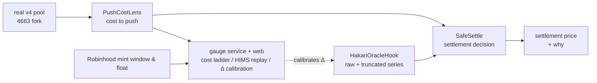

# HAKARI (秤, "the scale") — what it costs to fake a price

ETHGlobal Tokyo 2026 · Uniswap Foundation track · spec written 2026-09-25 JST.

A scale for any protocol that reads a price from a Uniswap v4 pool: *can this price be pushed
right now, what would pushing it cost, and should the price be trusted?* This file is the
build spec. The original prompt it was translated from is `docs/prompts/2026-09-25-spec-zh.md`.

- [0. Rules for the AI](#0-rules-for-the-ai)
- [1. The problem, with numbers](#1-the-problem-with-numbers)
- [2. Core idea: three layers of trust](#2-core-idea-three-layers-of-trust)
- [3. The four things we build](#3-the-four-things-we-build)
- [4. Cost model v0](#4-cost-model-v0)
- [5. Demo script](#5-demo-script)
- [6. Prize requirements](#6-prize-requirements)
- [7. The 36-hour plan](#7-the-36-hour-plan)
- [8. Risks and open questions](#8-risks-and-open-questions)
- [9. Appendix: addresses, pools, numbers](#9-appendix-addresses-pools-numbers)

## 0. Rules for the AI

See `AGENTS.md`. In short: mainnet 4663 is read-only; every transaction goes to an anvil fork
of 4663 or to testnet 46630; no pre-hackathon code is pasted in (knowledge and public chain
data are reused, code is rewritten); public libraries are allowed; no `.env` or key is ever
read or printed; MIT, English, continuous commits.

## 1. The problem, with numbers

Every protocol that reads a price from a v4 pool — options, lending, perps, liquidations —
assumes the pool's price is real. That assumption fails in three situations, and we have
measured or traced each of them:

| Case | What happens | Measured | Source |
| --- | --- | --- | --- |
| **A. Atomic push** | The protocol reads the live price (`slot0`), or a rate limiter that accumulates "movable budget" while the pool is quiet. The attacker pushes the pool, trades against the pushed quote and pushes it back **in the same transaction**. Flash-loanable; nothing has to be held. | On an options venue on Robinhood testnet (Vexi, our own protocol on 46630): **+87 bps per contract** after fees. Atomic probe: after 30 s of quiet, a 5 % push moved the rate limiter +299 bps and netted the attacker **+181.7 bps** per contract; after 5 s of quiet, +17.7 bps. | Our own measurement on 46630, testnet only, no real money. |
| **B. Sustained push** | The protocol reads a TWAP. The attacker holds the pool off-price for seconds to minutes; the first swap of every second writes the pushed tick into the record. With no truncation, **one observation can jump arbitrarily far**, so a thin pool held for a short time moves the TWAP. | OpenZeppelin's `BaseOracleHook(2 * MAX_TICK)` is equivalent to truncation off (1,774,544 ticks: no jump is ever clipped). | `uniswap-hooks/src/oracles/panoptic/libraries/Oracle.sol` `transform`. |
| **C. A fenced pool** | Stock-token minting and redemption close for the weekend; no arbitrageur holds a hard reference price; most of the float drains into one pool. Pushing is nearly free because nobody pushes back. | HIMS on Robinhood Chain 4663: on Sunday 2026-08-30 the HIMS/USDG v4 pool went from **29.38** to **54.50 USDG** while NYSE had closed at **28.84**; HIMS principal in the pool fell from **2,606** to **32** tokens; it returned to 29.31 after the first Monday mint. | On-chain reconstruction from `ModifyLiquidity` and `Swap` logs (2026-09-25); NYSE close is secondary data. |

HIMS/USDG (4663), five observation points (blocks 50,265,277 / 50,415,299 / 50,444,948 /
50,490,000 / 50,772,447): pool price in USDG against the 28.84 NYSE close, and HIMS principal
in the pool. Principal is the curve principal implied by each position's liquidity, the price
and the range bounds — not "what can be sold within 1 % of price". Over the same period HIMS
flowed into the BONER/HIMS pool (principal 7,068 → 12,796): inventory moved, it was not
locked. A Shapley accounting split attributes 90.76 % of the principal drop to price /
out-of-range effects and 9.24 % to LP position changes — an accounting attribution between two
observed prices, not a causal identification.

**The hard part is a trade-off, not a bug.** Turning truncation on (Panoptic uses at most 250
ticks per observation on wstETH/ETH) blocks B and C, but in a genuine crash or squeeze the
truncated price lags, settlement uses a stale price, and honest holders are short-changed.
That is exactly why some protocols turn truncation off. **HAKARI's answer: whether a price move
deserves trust depends on what it would cost to fake it, compared with what faking it would
earn.**

## 2. Core idea: three layers of trust

**Layer 1 — against A: a price that crosses a block boundary.** The oracle hook records the
tick *before the first swap of each second*. A push that is undone within the same second is
never recorded. The live price (`slot0`) and budget-accumulating rate limiters have no such
protection.

**Layer 2 — against B: how far one step may go.** The truncated series moves at most Δ ticks
per observation. To move the truncated price by `d`, the attacker must hold for at least
`⌈d/Δ⌉` seconds, one observation per second. Δ is calibrated from the pool's own history: the
99th percentile of honest per-second tick moves.

**Layer 3 — against C and the trade-off: cost to fake versus gain.** When the raw and the
truncated series disagree, measure what it costs to push the price to where the raw series
says it is and hold it for the whole window. If the cost exceeds the gain from this settlement,
trust the raw price; if not, use the truncated one. When arbitrage is closed (weekend stocks)
the cost collapses and the layer turns conservative by itself.



## 3. The four things we build

### 3.1 `PushCostLens` (Solidity): what it costs to push a pool

For any v4 pool on the official PoolManager, answer: "to push the price up/down by `x` ticks
and back, how much capital is needed and how much is paid in fees?" Two modes:

| Function | How | Consumer |
| --- | --- | --- |
| `quotePush(PoolKey key, int24 ticks, bool up) → PushQuote` | **Exact simulation.** Inside `unlockCallback`: swap with `sqrtPriceLimitX96 = target price` and a huge exact-input amount to reach the target, record the `BalanceDelta`; swap back with the start price as the limit, record; then `revert` with the encoded result (the `V4Quoter` pattern). State is fully reverted. Runs the pool's real hooks and fees. | Off-chain `eth_call` (gauge, web). Works on mainnet with an `eth_call` state override — no deployment needed. |
| `depthToMove(PoolKey key, int24 ticks, bool up) view → (amountIn, feePaid, complete)` | **View tick walk.** Read `slot0`, `liquidity`, the tick bitmap and per-tick `liquidityNet` through `StateLibrary` (extsload), accumulate `SqrtPriceMath.getAmount0Delta / getAmount1Delta` segment by segment up to the target tick, add the swap fee (LP fee combined with the protocol fee the way `Pool.swap` does). No unlock needed, so it is callable from inside another transaction. Bounded by a step cap; past the cap it reports `complete = false` ("deep enough not to matter"). | On-chain: `SafeSettle`. |

```solidity
struct PushQuote {
    uint160 sqrtPriceStart;   uint160 sqrtPriceTarget;  uint160 sqrtPriceReached;
    uint256 amountIn;         uint256 amountOut;        // push leg
    uint256 amountBackIn;     uint256 amountBackOut;    // return leg
    int256  netDelta0;        int256  netDelta1;        // attacker's net position after the round trip (≤ 0)
    uint256 costInCurrency0;  uint256 costInCurrency1;  // the round trip's loss, valued in one currency at the start price
}
function quotePushLadder(PoolKey calldata key, int24[] calldata ticks, bool up) external returns (PushQuote[] memory);
```

Note: v4 forbids nested `unlock` (`PoolManager` reverts `AlreadyUnlocked`), so `quotePush`
cannot be called from inside someone else's unlock; on-chain callers use `depthToMove`.

**Self-check at hour 6.** A pre-hackathon fork measurement (4663, block 71,937,777): buying
10 TSLA in the TSLA/USDG pool and selling back in the same unlock nets **−26.560259 USDG**. At
the same block, `quotePush` with a push sized to 10 TSLA must land near that number. A mismatch
means a direction, unit or fee error.

### 3.2 `HakariOracleHook` (Solidity): keep both series

```solidity
contract HakariOracleHook is BaseOracleHook {        // OpenZeppelin uniswap-hooks, MIT
    constructor(IPoolManager m, int24 maxAbsTickDelta) BaseHook(m) BaseOracleHook(maxAbsTickDelta) {}
    /// geometric TWAP ticks over [now - window, now], raw and truncated
    function twaps(PoolId id, uint32 window) external view returns (int24 rawTick, int24 truncTick);
}
```

- Permissions: only `afterInitialize` and `beforeSwap`; address bits `0x1080`. No return
  delta, no dynamic fee, so Uniswap routers index the pool normally.
- `BaseOracleHook.observe(secondsAgos, poolId)` already returns both cumulative series (raw,
  truncated); `twaps` packs them into two ticks.
- Δ is immutable: **one hook contract has one Δ**. Different Δs mean different hooks (e.g. a
  "stock-grade" and a "memecoin-grade" hook), each with its own mined salt.
- Deployed against the **official PoolManager** `0x8366…0951`: demoed on a fork of 4663 and
  deployed once for real on testnet 46630 (same PoolManager address and bytecode) for a public
  transaction hash.
- Demo pool: on the fork, a new "shadow pool" with this hook attached, seeded with a few
  liquidity ranges shaped like a real pool's tick liquidity. The real pool has no hook, so it
  can only be shadowed.

### 3.3 `SafeSettle` (Solidity): a demo settlement decision

A simple cash-settlement contract (a demo, not a product) that decides at expiry which price
to use, and writes *why* into an event.

```solidity
function settlePrice(PoolKey calldata key, uint32 window, uint256 notionalAtStake, bool quoteIsCurrency0, bool arbOpen)
    external view returns (int24 tickUsed, bool usedRaw, uint256 costToFake, uint256 gainIfFaked);
// 1. (raw, trunc) = hook.twaps(id, window)
// 2. d = |raw - trunc|;  if d <= TOLERANCE_TICKS → use raw (nothing to explain)
// 3. costToFake = CostModel.v0(lens.depthToMove(key, d, raw > trunc), window, arbOpen)
// 4. gainIfFaked = notionalAtStake × (1.0001^d − 1)      // payout moved by the fake
// 5. costToFake > gainIfFaked → raw (a genuine move; truncation would only lag)
//    otherwise              → trunc (cheap to fake; do not pay on it)
event Settled(PoolId indexed id, int24 rawTick, int24 truncTick, bool usedRaw, uint256 costToFake, uint256 gainIfFaked);
```

`arbOpen` is supplied by the caller; in the demo the gauge supplies it: false for stock tokens
while the mint window is closed. This flag is where the gauge is trusted; the README says so.

### 3.4 Gauge service + web (TypeScript): draw the cost

- **Cost ladder.** For a list of 4663 pools (TSLA/USDG, NVDA/USDG, HIMS/USDG, a few memecoin
  pools) compute the round-trip cost of a 1 % / 5 % / 10 % push with `quotePushLadder`,
  refreshed every N blocks.
- **Δ calibration.** Read a pool's `Swap` events, build the distribution of per-second tick
  moves, take the 99th percentile as the suggested Δ (Panoptic's method).
- **HIMS weekend replay.** From the HIMS/USDG pool's `Initialize` to block 50,772,447,
  rebuild every position (sender, tickLower, tickUpper, salt) from `ModifyLiquidity` events,
  and at the five observation points of § 1 compute "USDG needed to push 10 %"; plot the
  weekend cost collapse. The public RPC no longer serves that old *state* but does serve the
  *events*, so the replay is event-based; a fork of that day is impossible. The collector is
  written during the hackathon.
- **Mint-window flag.** Robinhood stock-token minting/redemption is closed from Saturday
  02:00 to Monday 02:00 CET (secondary data). In the HIMS case the first mint after the close
  was 2026-08-31 00:43:30 UTC, consistent. The official asset API's `tradingCapabilities`
  (market / extended / overnight) is read as well.
- **Web.** Paste a pool → see "cost to push 5 % right now", whether it is fenced this moment,
  and the suggested Δ; a second page shows the HIMS replay and `SafeSettle`'s decision log.
  Judges must be able to play with it.

## 4. Cost model v0

Written with its assumptions, to be refined later.

To move a `W`-second window's raw TWAP by `x` ticks, the attacker must hold the pool `d` ticks
off-price for `s` seconds with `d · s ≥ x · W` (`s ≤ W`).

| Term | v0 | Assumption |
| --- | --- | --- |
| Push up and back | `roundTrip(d)` = swap fees on both legs of `depthToMove` + price-impact loss | Exact, from the pool's real liquidity (the impact loss of an exact retrace is zero; fees remain) |
| Holding cost | Arbitrage open: pulled back every second and re-pushed → ≈ `s × roundTrip(d)`; arbitrage closed: ≈ 0 | The crudest term; calibrated on HIMS (closed) and a weekday TSLA (open) |
| Time to move the truncated series | Each observation moves at most Δ, at most one observation per second → at least `⌈d/Δ⌉` seconds | Exact, from `Oracle.transform` |
| `costToFake(x)` | `min over (d, s)` of `roundTrip(d) + (arbOpen ? s × roundTrip(d) : 0)` | A conservative lower bound; err on "cheap" |
| `gainIfFaked(x)` | `notional × (1.0001^x − 1)` | For a deep-in-the-money option, delta ≈ 1 |

This yields a **maximum safe open interest** directly:
`n_max = min over x of costToFake(x) / (S × (1.0001^x − 1))` — the same reasoning lending
protocols use to cap supply by liquidity.

## 5. Demo script (~3 min; video 2–4 min, no TTS)

1. **0:00–0:30 The problem.** Web: what a 5 % push of TSLA/USDG costs in USDG right now. Cut
   to the HIMS replay: the same number falls to almost nothing on the weekend while the pool
   price goes from 29.38 to 54.50. "How much trust a price deserves depends on what it costs
   to fake."
2. **0:30–1:15 Layer 1.** On the fork: an atomic push. A demo protocol that reads `slot0` is
   fooled and pays out; after the same transaction, `HakariOracleHook`'s two series have not
   moved (the observation is written before the swap).
3. **1:15–2:15 Layers 2 and 3.** A sustained push on the thin shadow pool for N seconds: the
   raw TWAP moves, the truncated TWAP barely does. `SafeSettle` finds `costToFake <
   gainIfFaked` → uses the truncated price; the attacker only paid fees. Then a genuine surge:
   deep pool, arbitrage open, many independent trades → `costToFake > gainIfFaked` → uses the
   raw price; the truncated lag is avoided.
4. **2:15–2:45 Public evidence.** Transaction hashes of the hook and lens deployed on testnet
   46630; the README points at the `unlockCallback`, `swap` and `BalanceDelta` lines. "Any
   protocol can call `PushCostLens`."

## 6. Prize requirements (Uniswap · Best Uniswap Stack Contribution)

| Requirement | How | When |
| --- | --- | --- |
| Public open-source GitHub repo | MIT, created at H0 | H0 |
| `FEEDBACK.md` | Honest friction log from H1 on (e.g. the docs do not list 46630 though the same PoolManager is there; hook salt mining on a new chain; the OZ `observe` interface). Only what actually happened. | H1 → |
| Uniswap Developer Feedback Form with the `FEEDBACK.md` link | `developers.uniswap.org/hackathon-feedback` | H27 |
| README points at contracts and lines | Table: PoolManager address → `PushCostLens` unlock / swap / BalanceDelta lines; `HakariOracleHook.twaps`; `SafeSettle` decision lines; 46630 tx hashes | H27 |
| (ETHGlobal) video, AI disclosure, spec and prompts | 2–4 min, ≥ 720p, human voice; this spec and the prompts under `docs/prompts/` | H31 |

Other partner slots: only Uniswap is natural for this project. Curvegrid, 1inch, World, ENS,
Sui and Intercepta are not forced in.

## 7. The 36-hour plan

H0 = 2026-09-25 21:00 JST. Deadline 2026-09-27 09:00 JST. Target: submit by H33 (06:00 JST),
three hours of slack.

| Slot | Contracts | Data and gauge | Gate |
| --- | --- | --- | --- |
| H0–H1 | Repo (MIT); pin `v4-core`, `uniswap-hooks`, `forge-std`; fork a recent 4663 block; open `FEEDBACK.md` | | |
| H1–H6 | `quotePush` runs on the real TSLA/USDG pool | Collect HIMS/USDG `ModifyLiquidity` + `Swap`, rebuild positions | **G1:** 10-TSLA round trip ≈ −26.56 USDG; HIMS active liquidity at the five points matches the `Swap` events |
| H6–H14 | Hook + shadow pool, `depthToMove`, `SafeSettle` | Cost ladder, Δ calibration, HIMS cost curve | |
| H14–H22 | Attack scripts, the three cases as tests | Web wiring | **G2:** the whole demo runs on the fork with one command |
| H22–H27 | 46630 deployment, README line pointers | `FEEDBACK.md`, feedback form | |
| H27–H31 | Video, booth script | | |
| H31–H33 | Slack, submit (Uniswap prize) | | **G3:** submitted |

**Cut order** (first to go): web polish → 46630 public deployment → the "genuine surge" case →
automatic Δ calibration (fall back to a hard-coded Panoptic-style value). **Floor:**
`PushCostLens` + hook + `SafeSettle` with the atomic and sustained cases + HIMS cost curve + the
four Uniswap paperwork items.

## 8. Risks and open questions

- **Cost model v0 is crude.** The holding cost depends on arbitrageurs; we can only give a
  lower bound. The README calls it "a report plus a replaceable decision rule", never a
  guarantee.
- **Gas of on-chain `depthToMove`.** Crossing many ticks is expensive; a step cap reports
  "too deep to matter" past it.
- **Old state is gone.** The public RPC returns `unavailable` for 2026-08-30 state; HIMS is
  event-reconstructed only (the reconstruction's active liquidity matches every `Swap`
  event's `liquidity` field, so the method is checked).
- **Stock-token transfer restrictions.** A pre-hackathon fork test showed TSLA transfers
  normally through v4; the shadow pool uses fork funds and this is re-checked at G1.
- **Judges' taste.** Of this prize's last six winners only one was a hook; most were products
  that really use Uniswap. The web page must let a judge paste a pool, not just read forge
  output.
- **Provenance line.** Knowledge comes in, code does not. The pre-hackathon collector is
  rewritten; no code from our other projects is pasted.

## 9. Appendix: addresses, pools, numbers

### Uniswap on Robinhood Chain mainnet 4663 (checked with `eth_getCode`)

| Contract | Address |
| --- | --- |
| v4 PoolManager | `0x8366a39CC670B4001A1121B8F6A443A643e40951` |
| v4 StateView | `0xF3334192D15450CdD385c8B70e03f9A6bD9E673b` |
| v4 Quoter | `0x8Dc178eFB8111BB0973Dd9d722ebeFF267c98F94` |
| v4 PositionManager | `0x58daec3116aae6D93017bAAea7749052E8a04fA7` |
| Universal Router | `0x8876789976decbfcbbbe364623c63652db8c0904` |
| Permit2 | `0x000000000022D473030F116dDEE9F6B43aC78BA3` |

Testnet 46630 has the official PoolManager at the same address (same bytecode hash, deployed
2026-07-10 by the standard CREATE2 deployer, different owner), and PositionManager, Quoter,
StateView, Permit2 and Universal Router too. The Uniswap docs do not list 46630.

RPCs: mainnet `https://rpc.mainnet.chain.robinhood.com` (read-only for us), testnet
`https://rpc.testnet.chain.robinhood.com/rpc`.

### Pools used (4663)

| Pool | id | key |
| --- | --- | --- |
| TSLA/USDG | `0x8517f8071ae5b831b738052f12125e8e3d6c158b78728aa44ce3b25e5104d32e` | currency0 = TSLA `0x322f0929c4625ed5bad873c95208d54e1c003b2d`, currency1 = USDG, fee 3000, tickSpacing 60, no hook |
| NVDA/USDG | `0x3bb34a44f1b2b5f32c034c38a53065a521a47b199700fa9bd19d60985ff24bf1` | currency0 = USDG, currency1 = NVDA `0xd0601ce157db5bdc3162bbac2a2c8af5320d9eec`, fee 3000, tickSpacing 60, no hook |
| HIMS/USDG | `0x68d4f28f1432e0ad714658853edb2e6b0b1ac4060355ff3d169fea656b1d1c52` | currency0 = USDG, currency1 = HIMS, fee 9000, tickSpacing 90, no hook; protocol fee 1000 pips each way, so the effective swap fee is 9,991 pips |
| BONER/HIMS | `0x9c89b04303dfa76f3f6fb02c2b77be0e8a00ab8fa00d507119acd54ab3e8640d` | dynamic fee, tickSpacing 8, hook `0x4e3468951d49f2eea976ed0d6e75ffcb44a9a544` |

Tokens: HIMS `0xccee82fe024c36fa15e1005ede3e9e4787e23d09` (18 decimals), USDG
`0x5fc5360d0400a0fd4f2af552add042d716f1d168` (6 decimals).

### HIMS case

| Item | Value |
| --- | --- |
| Observation window | blocks 48,555,213 – 50,444,948; first new mint at 50,444,949 (2026-08-31 00:43:30 UTC) |
| On-chain float (event reconstruction) | 15,226.813 HIMS in the window → 33,977.293 at block 50,772,447 |
| TSLA reference | block 71,937,777: buy 10 and sell back in the same pool, net −26.560259 USDG (fork, before gas) |

### Library references

- OpenZeppelin `uniswap-hooks` @ `acbd604`: `src/oracles/panoptic/BaseOracleHook.sol`
  (constructor `_maxAbsTickDelta`; `observe` returns raw and truncated cumulatives),
  `libraries/Oracle.sol` (`transform` clips each observation to ±Δ; at most one write per block
  timestamp). Panoptic uses Δ = 250 on wstETH/ETH; OZ's tests use 9116.
- Uniswap `v4-core` @ `d153b048`, `forge-std` @ `bf647bd`.
