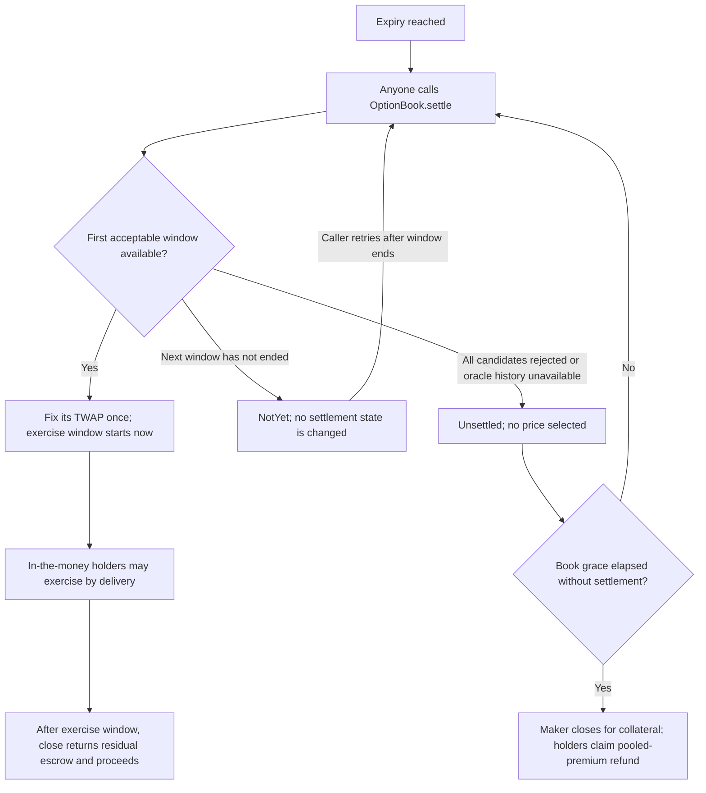

# Experimental settlement: accepted windows, deferral and refunds

HAKARI's primary demonstration is quote protection before a new fill. `HookTwapExpiryPrice` is a separate
experimental adapter. It selects a price according to a public rule; it does not prove that price represents a
fair external market. This document describes existing behavior, not a new fallback or an automatic keeper.

## State flow

Every arrow involving a contract action needs a transaction. Reverts do not schedule retries. Quote deadlines and
price anchors apply to new purchases, not to settlement or exercise of existing positions.

## Which time's price is selected?

With the demonstration parameters, attempt `i = 0..5` ends at `expiry + i × 300 seconds` and reads the preceding
300 seconds of raw cumulative ticks. Attempt 0 ends at expiry; later accepted attempts end **after expiry**.
The first accepted candidate is used; callers cannot freely choose among accepted windows.

With `bandFromExpiry = true`, every candidate is compared to the same center from
`[expiry − 300 − 1800, expiry − 300]`, within a fixed 5% tolerance. The center is derived from that historical
window, not separately checkpointed before expiry. Holding a price through later attempts cannot move this center,
but manipulating its own historical window can affect it. `bandFromExpiry = false` instead rolls the center with
each attempt and can absorb a sustained move; it is not the demonstration default.

The last of six windows ends at expiry + 1,500 seconds. `maxDelay()` conservatively reports 1,800 seconds; the book
requires its settlement grace to exceed that value. Refunds open only **after the book's grace**, not automatically
when the last candidate is rejected. Settlement is allowed through the grace's final timestamp.

Once a price is computable, anyone may call `record(base, quote, expiry)` to cache it before oracle history wraps.
The book also stores an accepted settlement price once. Recording requires a caller and usable observations;
it does not recover a window already lost from the ring.

## Economic outcomes

| Situation | Contract behavior | Economic consequence |
|---|---|---|
| First window accepted | Fix the expiry-ending TWAP | Holders may exercise if in the money; exercise pays/delivers at the strike |
| First window rejected, later one accepted | Fix a later window; exercise window starts at actual settlement | The selected price can differ from the price at expiry |
| Genuine market gap remains outside the fixed band | No candidate accepted | A valid market move can end in refunds instead of exercise |
| A participant keeps candidates outside the band | No candidate accepted | A losing side may prefer the unwind; its cost depends on reference-market depth and arbitrage |
| No one settles in time, or needed observations are gone | Series remains unsettled | The same refund path applies regardless of why settlement failed |
| Series settled but a holder does not exercise in time | Unexercised collateral returns at close | There is no automatic intrinsic-value redemption in this small book |

On the unsettled path, maker collateral is returned through `close`; holders burn their long tokens through
`refund` for a pro-rata share of **pooled premiums by contract count**. They are not guaranteed their individual
purchase premium back if holders paid different amounts. Each claim is separate; these are not automatic transfers.
An out-of-the-money holder can receive a refund it would not have received on ordinary settlement, while an
in-the-money writer can recover collateral without delivery. Refusing a window is therefore not economically
neutral. A settled series is not refundable through this path.

## Evidence and scope

`aqua/test/StabilityTwapSettle.t.sol` covers window acceptance, rejection, deferral, a held push, caching and the
book integration. `aqua/test/BookRefund.t.sol` checks pooled refunds and independence from a maker's refusal to
close. `aqua/test/StabilityBandFork.t.sol` exercises the hook on the real PoolManager in a local mainnet fork.
These tests demonstrate the stated rules, not that rejecting prices or selecting later windows is appropriate for
every product. No alternative feed, discretionary override, cumulative quote budget or new settlement policy is
introduced by this documentation.
